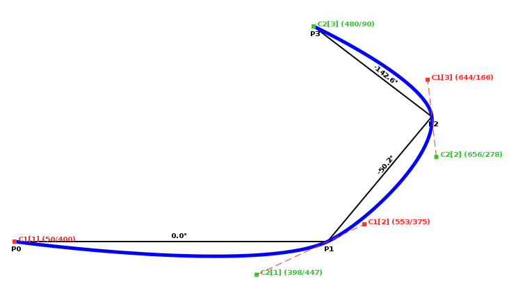

# Calculating Control Points For Bsplines

This article explains how to calculate the control points for
[B-Splines](https://en.wikipedia.org/wiki/B-spline). The basic idea is that we
want to interpolate a smooth curve into a set of points. B-Splines are a
sequence of Bezier curves which solve that problem. But each [Bezier
curve](https://en.wikipedia.org/wiki/B%C3%A9zier_curve) is defined by four
points: the start and end point and two control points which define the final
appearance of a curve segment.

I wrote a sample program which can be downloaded directly here. If you quickly
want to use it, simply look at the code and its comments. If your are
interested in the background go ahead and read this article 🙂

Bezier curves are commonly used in all fields of computer graphics. I came to
this topic while writing [Smrender](https://github.com/rahra/smrender), a
renderer for sea charts based on OpenStreetmap data. All polygons, such as e.g.
the coastline are represented as a set of points. Of course, the final result
will look more nicely if the line is a smooth curve.

Most graphics libraries already provide functions for creating Bezier curves,
e.g. the function `cairo_curve_to()` of the Cairographics library. But still,
in any case there is the need for control points.

My intention to write this article was that there are a lot of people in the
Internet questioning how to find control points but only rare or incomplete
solutions are found out there.

# What Are Control Points?

If we try to find a curve which fits smoothly between three given points then
there is an infinite number of curves that visit those three points. There is
not something like “the solution”. Bezier found an algorithm (and there are
other algorithms as well) which defines a specific curve between two points
together with two control points. In other words, if you have two points and
two control points, you can create a distinct curve using Bezier’s formula.
Thus, if you have a sequence of points you can create a more complex curve as
well. Creating the curve itself is actually done by the graphics library. Thus,
our job is to find those two control points for each line segment defined by a
start and an end point.

Have a look at Fig. 1. There are four points P0, P1, P2, and P3, thus there are
three line segments. The black lines show the direct connection between those
and the curve is shown in blue. Consider the points P1 and P2. To this segment
belong the control points C1[2] and C2[2]. Each line segment is one Bezier
curve defined by the starting point, the end point and two control points,
accordingly.

# Deriving Control Points

To get a smooth curve along a path of several connected line segments we have
to calculate two control points for each segment. For a a smooth blended
connection of the curve segments we have to take the preceding and succeeding
line segments into account. In particular, the first control point together
with the last control point of the preceding segment, and the starting point of
the line segment have to be a straight line. See Fig. 1: This is C2[1], C1[2],
and P1 as well as C2[2], C1[3], and P2.

The job is now to find this line. There is not just a single solution but
several possibilities. I implemented two variants in the sample program.[^1]

In the method of the isosceles triangle we calculate the mean value between two
subsequent line segments. For example in Fig. 1 the first line segment has an
angle of 0.0°, the second has -50.2°.[^2] The mean value is -25.1° which is the
angle of the tangent through P1. The tangent between the second and the third
segment has an angle of -96.4°.

To find the the angle of the tangent we could calculate the mean value of the
angle of the two line segments but this creates the problem that we would have
to handle the special cases when the value wraps around ±180°. Thus, I first
calculate that start and end point of the tangent and then its angle in a
second step. Again, let’s look at Fig. 1 and consider the control points for
the second segment between P1 and P2. The end point E of the first tangent is
set to P2 and the start point S is on the first segment at the same distance as
P2 is away from P1. This creates a virtual triangle between the points S, E,
and P1 where the edges S/P1 and E/P1 are of the same distance. That’s why it is
called the method of the isosceles triangle 😉

Finally we calculate the angle of this tangent and locate the (1st) control
point at “some” distance from P1 along the tangent moved through P1. In my
sample program I calculate the distance dependent on the length of the line
segment multiplied by ‘f’ where f is chosen to be 0.25. The value changes the
curviness. Simply play with it 😉

# The Source Code

You can download the source code of my example here. It generates a graphical
output using [Cairographics](http://www.cairographics.org/). The package
consists of several files. `bspline_ctrl.c` contains the core functions to
calculate the control points and draw a curve based on a sequence of points.
`bspline.h` contains some declarations and prototypes and `bspline.c` contains
the `main()` function. The file `bspline_constr.c` is actually not necessary
but it contains the code the create the captions and the auxiliary lines within
the image.

Have phun playing with the code and don’t hesitate to use it in your on
projects 🙂

[^1]: `#define` or undefine the macro `ISOSCELES_TRIANGLE` in `bspline_ctrl.c`
  to see the difference.
[^2]: In computer graphics the y-axis typically increases from the upper edge
  of an image to the lower. Thus, everything is flipped vertically compared to
  what is typically assumed in the theory of mathematics. Thus angles increase
  clockwise, starting with 0.0° on the right, to the bottom, to the left, to
  the top.

